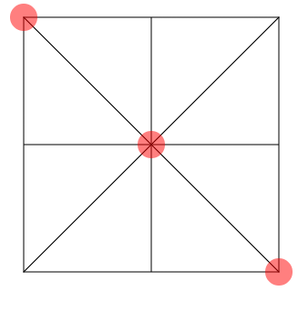
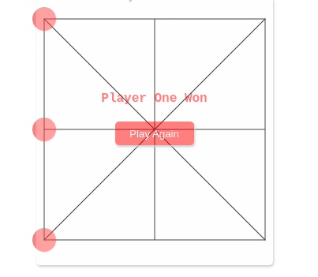
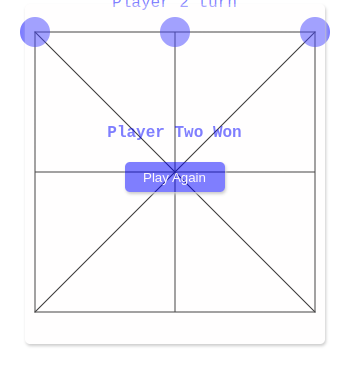
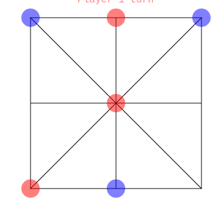

# Morabaraba-Game

---

## How to play:

- The players take turns marking spaces on the grid with chips

- The player who succeeds in placing three of their chips in a horizontal,vertical or diagonal row wins the game

- If all the chips are placed on the grid without on player being the winner

- Then you have to move the chips to win the game

# This is how you win

---

## Diagonal Win

## Horizontal Win

## Vertical Win

# This is one of the case you will have to move your chips to win the game

---

## Play game to win
